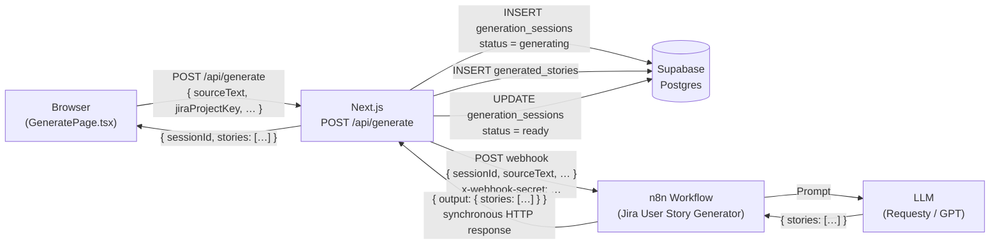
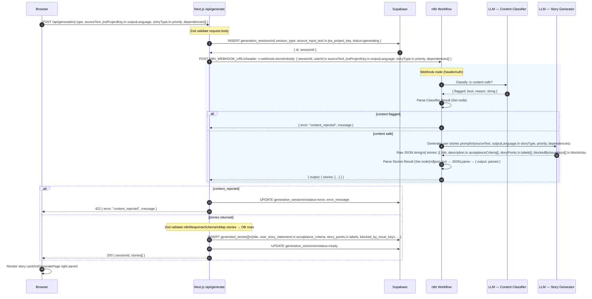
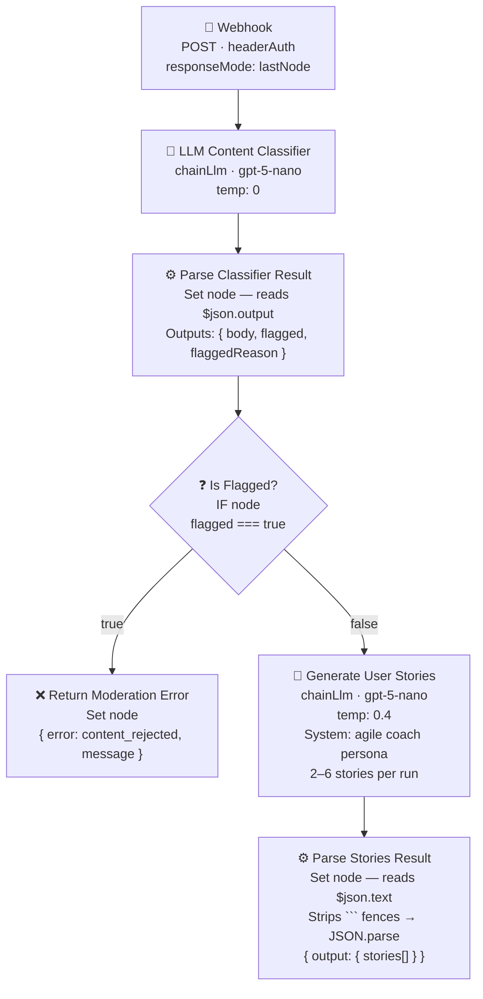

# User Story Generation — End-to-End Architecture

## High-Level Architecture



---

## Detailed Sequence



---

## n8n Workflow — Internal Node Graph



> **Key implementation detail:** `chainLlm` without a Structured Output Parser subnode writes the raw LLM text to `$json.text`. The **Parse Stories Result** Set node reads `$json.text || $json.output` to safely handle both cases, strips any markdown code fences, then `JSON.parse`s the result.

---

## Payload Contracts

### Next.js → n8n Webhook (`POST N8N_WEBHOOK_URL`)

| Field | Type | Notes |
|---|---|---|
| `sessionId` | `string` (UUID) | Supabase `generation_sessions.id` |
| `userId` | `string` (UUID) | Supabase `auth.users.id` |
| `type` | `"requirements" \| "sprint" \| "meeting" \| "ac_enrichment"` | Session type |
| `sourceText` | `string \| null` | Business requirements text |
| `audioPath` | `string \| null` | Path to uploaded audio (future) |
| `jiraProjectKey` | `string` | e.g. `"PROJ"` |
| `epicId` | `string \| null` | Jira epic ID |
| `sprintId` | `string \| null` | Jira sprint ID |
| `outputLanguage` | `string` | Default `"English"` |
| `storyType` | `"User Story" \| "Bug" \| "Task" \| "Sub-task"` | Default `"User Story"` |
| `priority` | `"Highest" \| "High" \| "Medium" \| "Low" \| "Lowest"` | Default `"Medium"` |
| `dependencies` | `{ type, issueKey, summary? }[]` | Jira issue links |

### n8n → Next.js Response (synchronous, `responseMode: lastNode`)

```json
{
  "output": {
    "stories": [
      {
        "title": "Export reports to CSV",
        "description": "As an analyst, I want to export reports to CSV so that I can share data.",
        "acceptanceCriteria": [
          "Given I am on the reports page, when I click Export, then a CSV download begins"
        ],
        "storyPoints": 3,
        "labels": ["user-story", "medium-priority"],
        "blockedByIssueKeys": [],
        "blocksIssueKeys": []
      }
    ]
  }
}
```

### Error response (content moderation rejection)

```json
{
  "error": "content_rejected",
  "message": "Input contains harmful content. Please revise your input and try again.",
  "stories": []
}
```

---

## Environment Variables

| Variable | Required | Description |
|---|---|---|
| `N8N_WEBHOOK_URL` | ✅ | Full URL of the n8n webhook trigger node |
| `N8N_WEBHOOK_SECRET` | ✅ | Sent as `x-webhook-secret` header; validated by n8n Header Auth credential |
| `NEXT_PUBLIC_SUPABASE_URL` | ✅ | Supabase project URL |
| `NEXT_PUBLIC_SUPABASE_ANON_KEY` | ✅ | Supabase anon key (browser) |
| `SUPABASE_SERVICE_ROLE_KEY` | ✅ | Supabase service role key (server — bypasses RLS for inserts) |
